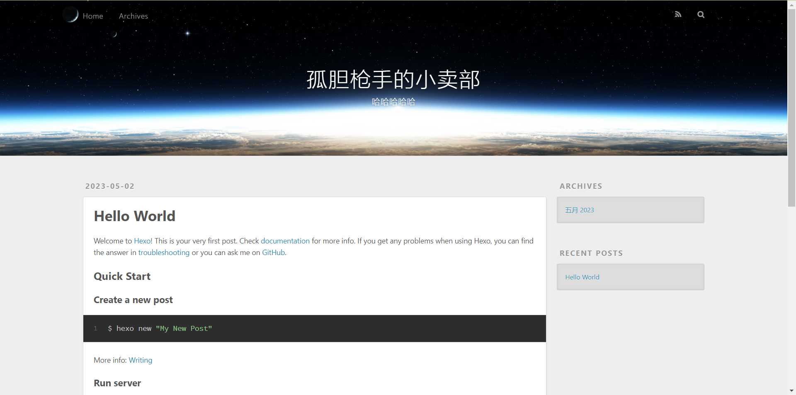

# blog
个人博客

## 步骤
### 基础搭建
1. hexo init blog # 初始化博客目录 
   cd blog # 进入博客文件目录 
   hexo server # 启动服务
2. 打开 localhost:4000 显示如下

### 主题
1. 浏览主题 https://hexo.io/themes/
2. 找到对应的 github，从 github 上下载主题文件放到博客的[themes](themes) 目录下
3. 修改博客的目录下的 _config.yml 中的 theme 选项为对应的主题目录名称
2. 添加主题
```
yarn add hexo-renderer-pug 
yarn add hexo-renderer-dartsass
yarn add hexo-generator-search
yarn add hexo-generator-feed
yarn add hexo-filter-flowchart
yarn add hexo-renderer-mathjax
```

## 坑
1. 免费版只支持 public 访问权限的仓库生成 pages
2. 

## 参考链接
1. [hexo 各个目录说明](https://hexo.io/zh-cn/docs/setup)
2. [hexo 配置](https://hexo.io/zh-cn/docs/configuration)
3. [github pages 免费版](https://docs.github.com/en/enterprise-cloud@latest/pages/getting-started-with-github-pages/changing-the-visibility-of-your-github-pages-site)