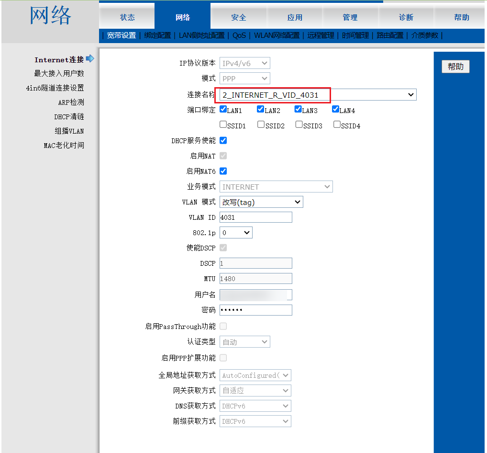
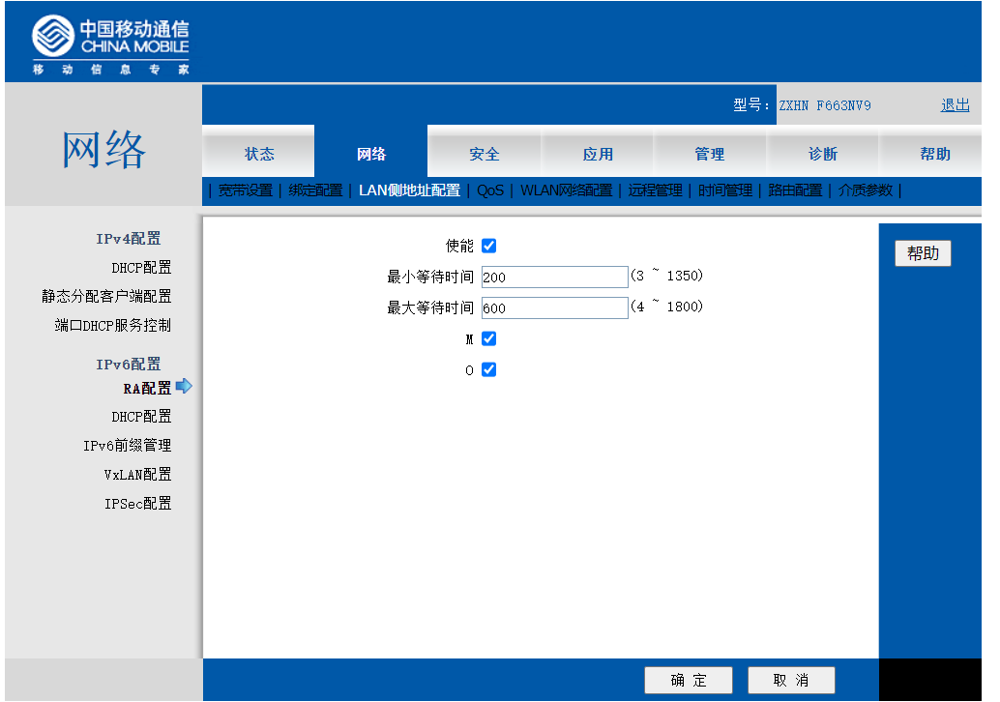
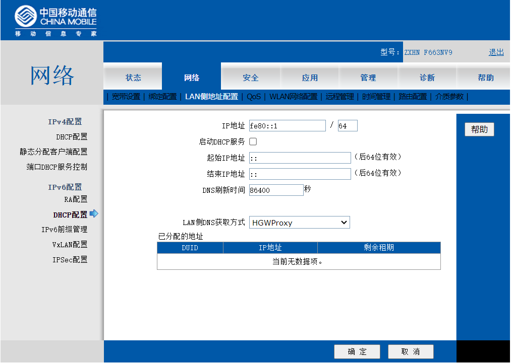
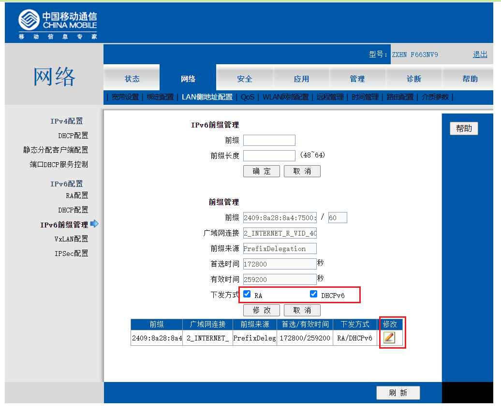
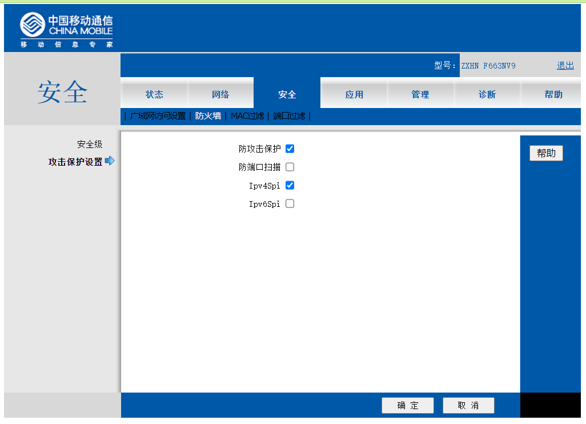
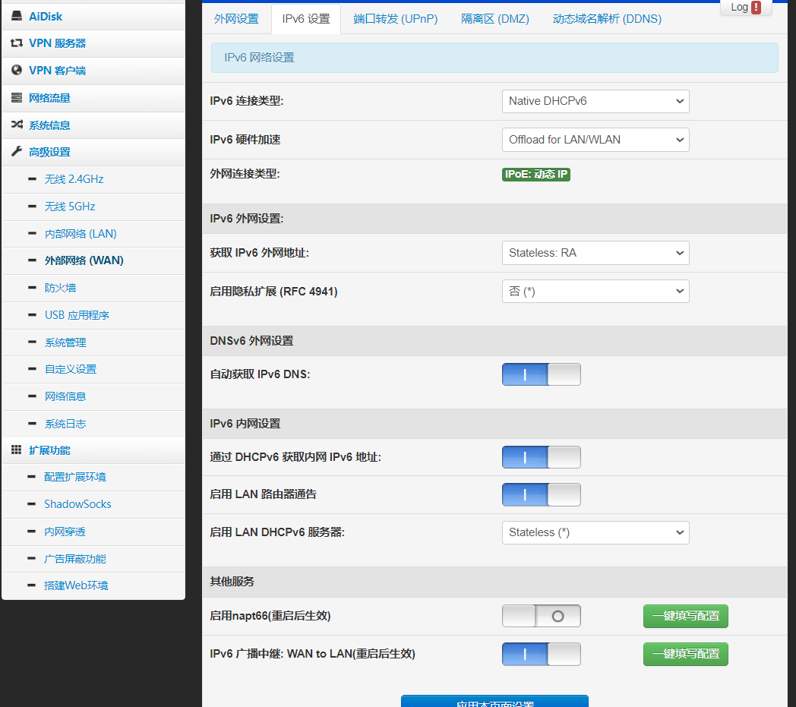
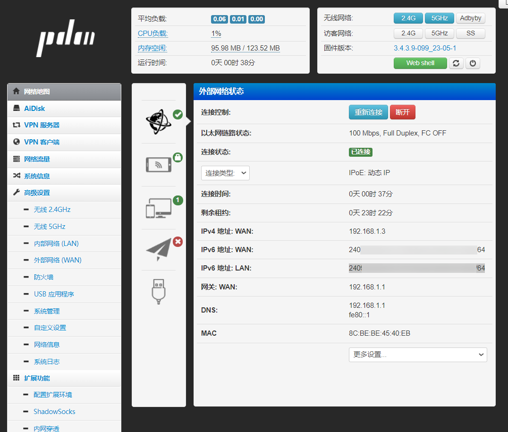
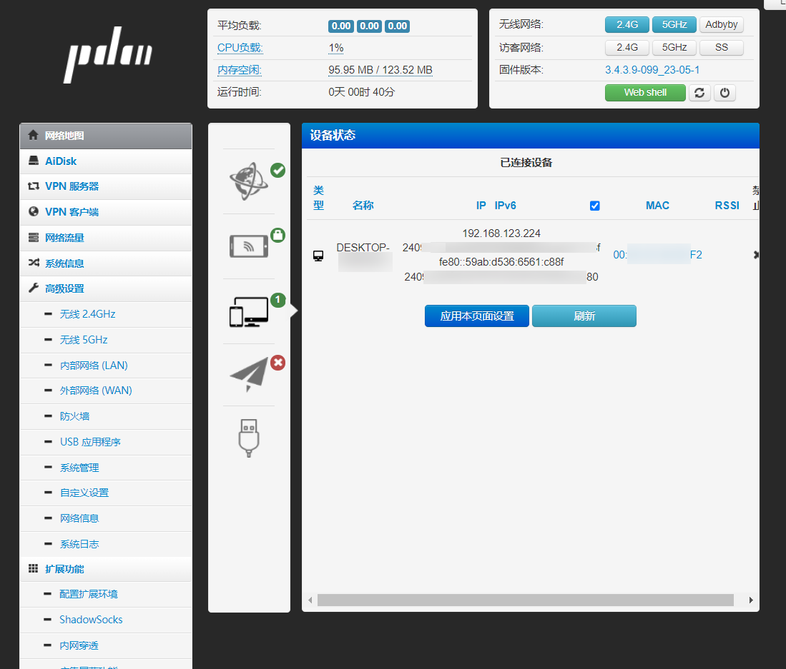
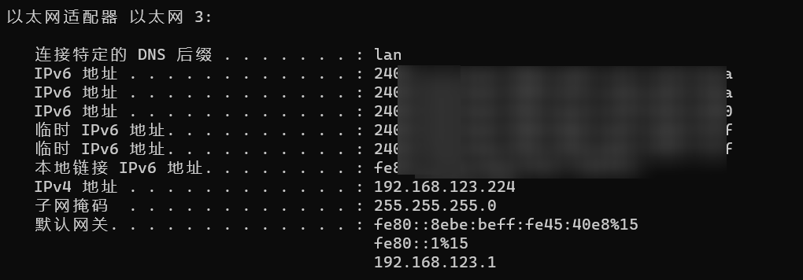

# 移动光猫+老毛子Padavan开启IPv6
> 多图杀猫

## 光猫配置

首先搜一下我使用的光猫版本有超级管理账号的，用户名 `CMCCAdmin`，密码：`aDm8H%MdA`，光猫的默认后台是 `http://192.168.1.1/`，登陆进去就是这样，

然后 网络->宽带设置->链接名称改成 `2_INTERNET_R_VID_4031`，其他的会自动填充上，（为了以防万一，可以先把网页保存一份，防止丢失密码），点确认。

端口绑定可以不选择 `SSID` 开头的，毕竟谁会用光猫自带的WiFi呢？

然后 `LAN侧地址配置`，左侧 `IPv6配置`-> `RA配置` 勾上 `M`、`O`，确认。

接着 `DHCP配置`，取消勾选 `启动DHCP服务`，确认。

继续 `IPv6前缀管理` 已有的前缀点下修改，然后勾选 `RA` 和 `DHCPv6`（貌似不勾选也行），修改。

然后 `安全`->`攻击保护设置` 取消勾选`Ipv6spi`，否则无法访问ipv6上的服务。确定。

光猫设置完成。此时可以试试电脑直连光猫，看下能否获取到 `IPv6` 的ip。

也可以使用 https://www.test-ipv6.com/ 测试一下（PS：记得关代理或者给它加白名单）。

## 老毛子 Padavan 设置

首先把光猫的 LAN 口链接路由器的 WAN 口，然后登陆路由器后台，`高级设置`->`外部网络`->`IPv6设置`，如下设置。然后应用设置

然后 `网络地图`->`外部网络状态`，可以看到路由器本身是获取到 `ipv6` 地址了

看下下面的设备状态，应该也是获取到 `ipv6` 的。

先本地 `ipconfig` 一下，是得到

再次上 https://www.test-ipv6.com/ 测试一下。

## 参考文档
1. https://post.smzdm.com/p/akk2r688/
2. https://www.v2ex.com/t/799717
3. https://cshihong.github.io/2018/01/29/IPv6%E9%82%BB%E5%B1%85%E5%8F%91%E7%8E%B0%E5%8D%8F%E8%AE%AE/
4. https://www.zhihu.com/question/379913035
5. https://zhuanlan.zhihu.com/p/452369365
6. https://www.right.com.cn/forum/thread-4059321-1-1.html
7. https://www.right.com.cn/FORUM/thread-1048239-1-1.html

